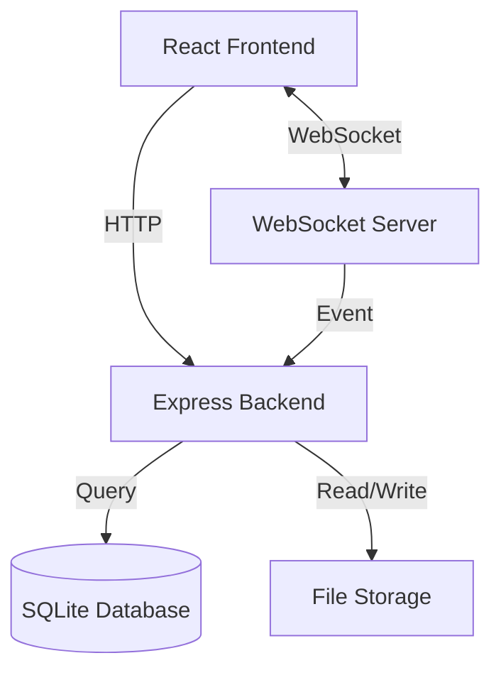
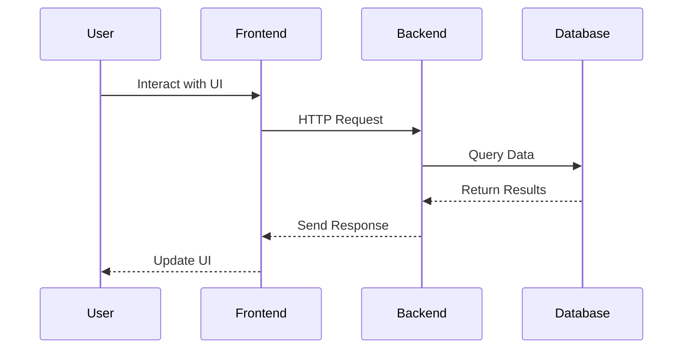
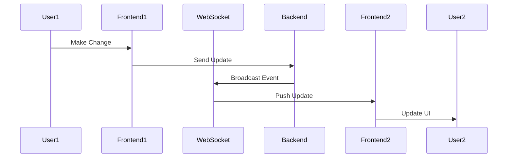
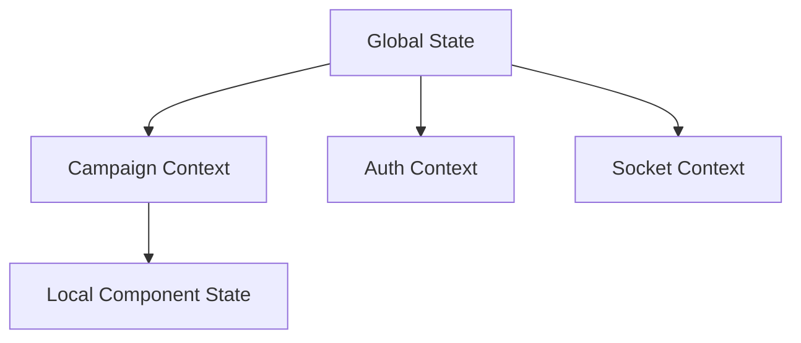
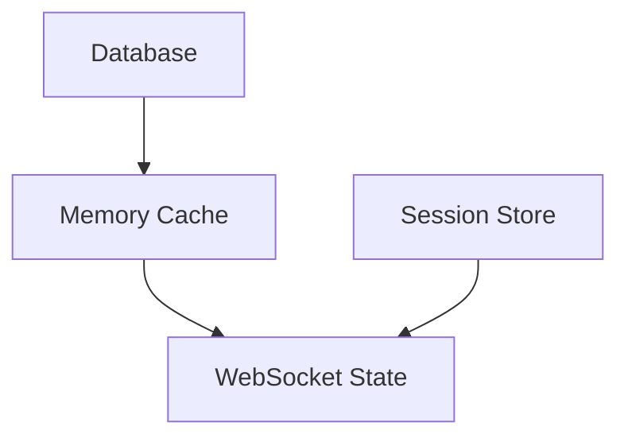
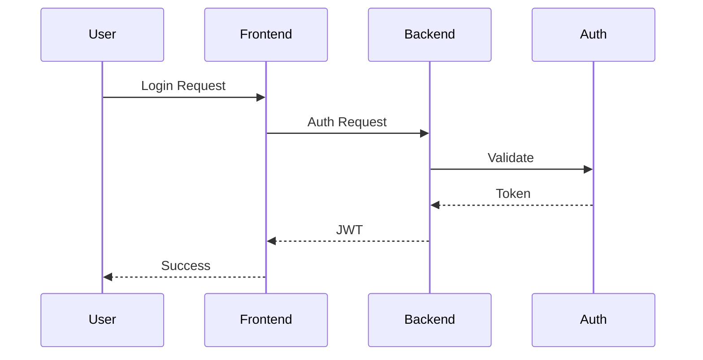
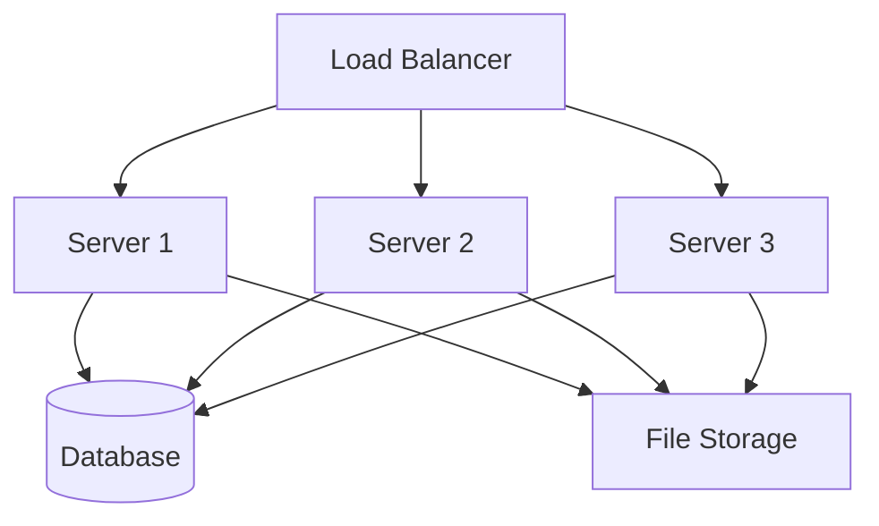
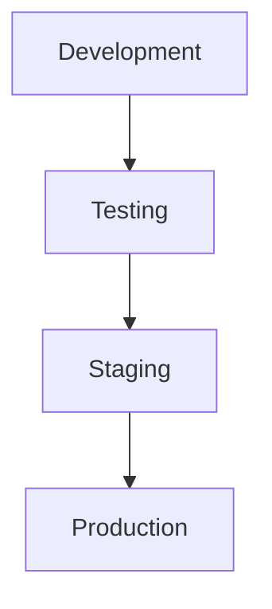
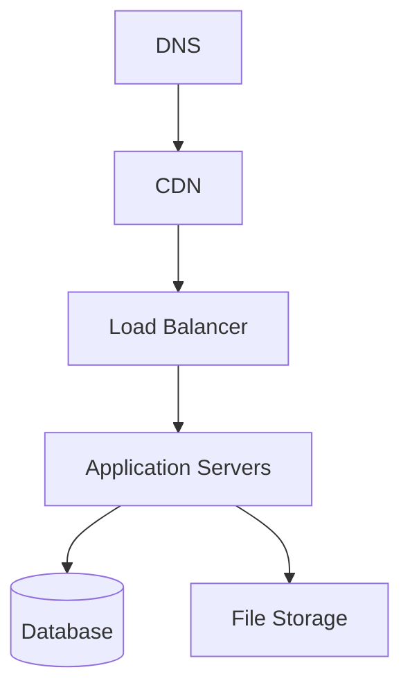

# System Architecture

## Overview

The Virtual Tabletop (VTT) application follows a client-server architecture with real-time communication capabilities. The system is designed to be scalable, maintainable, and provide a seamless user experience for tabletop gaming.

## System Components

## Technology Stack

### Frontend
- React 18 for UI components
- React Router for navigation
- Material-UI for component library
- Socket.IO Client for real-time updates
- Leaflet.js for map interactions

### Backend
- Node.js runtime
- Express.js web framework
- SQLite database
- Socket.IO for WebSocket server
- Multer for file handling

## Data Flow

### Request Flow

### Real-time Updates

## Core Subsystems

### 1. Campaign Management
- Campaign CRUD operations
- User permissions
- Campaign state management
- Data synchronization

### 2. Map System
- Map upload and storage
- Image processing
- Grid overlay system
- Marker management
- Fog of war

### 3. Combat Tracker
- Initiative tracking
- Turn management
- Status effects
- Combat history
- Statistics tracking

### 4. Timeline System
- Event management
- Chronological tracking
- Event categorization
- Timeline visualization

### 5. Activity Logger
- Action tracking
- Event filtering
- Real-time updates
- Export capabilities

## State Management

### Frontend State

### Backend State

## Security Architecture

### Authentication Flow

### Authorization Layers
1. JWT Validation
2. Route Guards
3. Resource Permission
4. WebSocket Authentication
5. File Access Control

## Scalability Design

### Horizontal Scaling

### Performance Optimization
1. Database indexing
2. Caching layers
3. Asset optimization
4. Connection pooling
5. Load balancing

## Deployment Architecture

### Development Environment

### Production Environment

## Monitoring and Logging

### Metrics Collection
1. Application metrics
2. System metrics
3. Business metrics
4. User metrics

### Logging Levels
1. Error tracking
2. Performance monitoring
3. User activity
4. System health

## Disaster Recovery

### Backup Strategy
1. Database backups
2. File system backups
3. Configuration backups
4. State snapshots

### Recovery Procedures
1. System restoration
2. Data recovery
3. State reconciliation
4. Service resumption

## Future Considerations

### Planned Improvements
1. Microservices architecture
2. Container orchestration
3. Cloud migration
4. AI integration

### Scalability Roadmap
1. Database sharding
2. Global distribution
3. Edge computing
4. Service mesh 